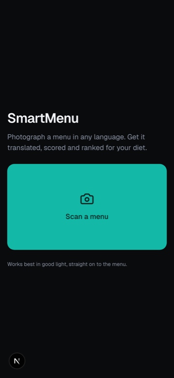
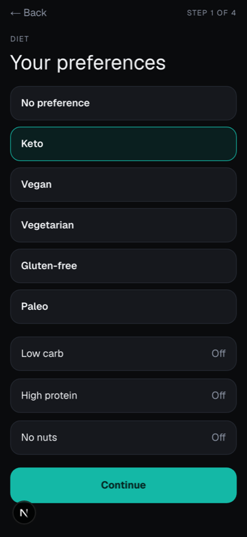
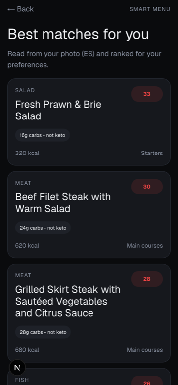
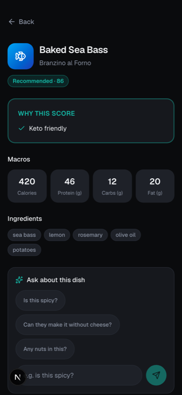

# SmartMenu

Photograph a menu in any language. Get it translated, nutrition-scored and
ranked against your diet.

A mobile-first React web app - open it on a phone, no install.

**Live: https://smartmenu-two-ruddy.vercel.app**

| Scan | Preferences |
|---|---|
|  |  |

| Smart Menu | Dish details |
|---|---|
|  |  |

*Real output: a photographed Argentine menu, read in Spanish, ranked for keto.*


## How it works

One multimodal model call does OCR, structuring, translation and nutrition
estimation in a single pass, returning strict JSON. A deterministic scoring
function then ranks each dish against the diet you picked.

```
photo -> downscale in browser -> /api/analyze -> gemini-3.6-flash (JSON schema)
      -> zod validate -> scoreDish() -> ranked menu
```

## Quick start

```bash
npm install
cp .env.example .env.local   # add your own GEMINI_API_KEY
npm run dev
```

Needs Node 22 or 24.

**No API key? It still runs.** Every screen renders from `lib/fixtures.ts`, and
`POST /api/analyze?demo=1` returns the demo menu instantly.

## Category photos

Dish tiles show a generated photo per category when one exists, and a gradient +
icon when it does not. The fallback is the default state and looks deliberate, so
this is optional.

```bash
npm run photos          # writes public/dishes/*.png, skips what exists
git add public/dishes
```

Image generation sits on its own per-day free-tier quota, separate from the text
quota. If every key is spent the script says so and changes nothing - re-run
after the daily reset. A committed file always wins over generating at runtime,
so the Smart Menu screen never waits on an image.

## Stack

Next.js 16 (App Router) - TypeScript - Tailwind v4 - zod - zustand -
Gemini `gemini-3.6-flash` with an OpenAI `gpt-4o` fallback - deployed on Vercel.

## Layout

```
app/            routes; pages own data and state
  api/analyze/  the one server endpoint
components/     all visuals
lib/
  schema.ts     the zod contract - frozen
  llm.ts        model call, prompt, retry, fallback
  scoring.ts    scoreDish(item, prefs) -> score, label, reasons
  image.ts      browser-side downscale + base64
  fixtures.ts   the demo menu
  store.ts      client state
docs/           plan, conventions, demo script
```

## Contributing

Read [`docs/CONVENTIONS.md`](docs/CONVENTIONS.md) first - file ownership, branch
names and PR rules.

- [`docs/PLAN.md`](docs/PLAN.md) - what we are building and why
- [`docs/WALKTHROUGH.md`](docs/WALKTHROUGH.md) - the build explained for someone who did not write it
- [`docs/SmartMenu-Handbook.pdf`](docs/SmartMenu-Handbook.pdf) - **14-page team handbook and judge briefing**, including the full schema and prompt
- [`docs/PITCH.md`](docs/PITCH.md) - the three-slide pitch and speaker notes
- [`docs/DEMO_SCRIPT.md`](docs/DEMO_SCRIPT.md) - the 90-second run, and what to do if it breaks
